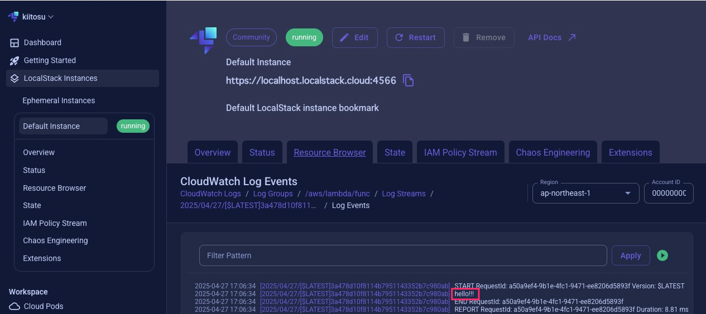

# terraform-localstack-lambda-integration

## 動作確認

1. コンテナをビルドします
```zsh
docker-compose build
```

2. コンテナを起動します
```zsh
docker-compose up
```

3. lambda関数を実行します
```zsh
awslocal lambda invoke --function-name func /dev/stdout | jq
```

## 結果
### ターミナル出力
以下のような結果になります。
最初にlambda関数の出力が表示されます。
その次のlambdaのメタデータが表示されています。
```zsh
$ awslocal lambda invoke --function-name func /dev/stdout | jq
{
  "StatusCode": 200,
  "I am in": "localstack!!!"
}
{
  "StatusCode": 200,
  "ExecutedVersion": "$LATEST"
}
```

### localstackでの動作
こんな感じで出力されています。
